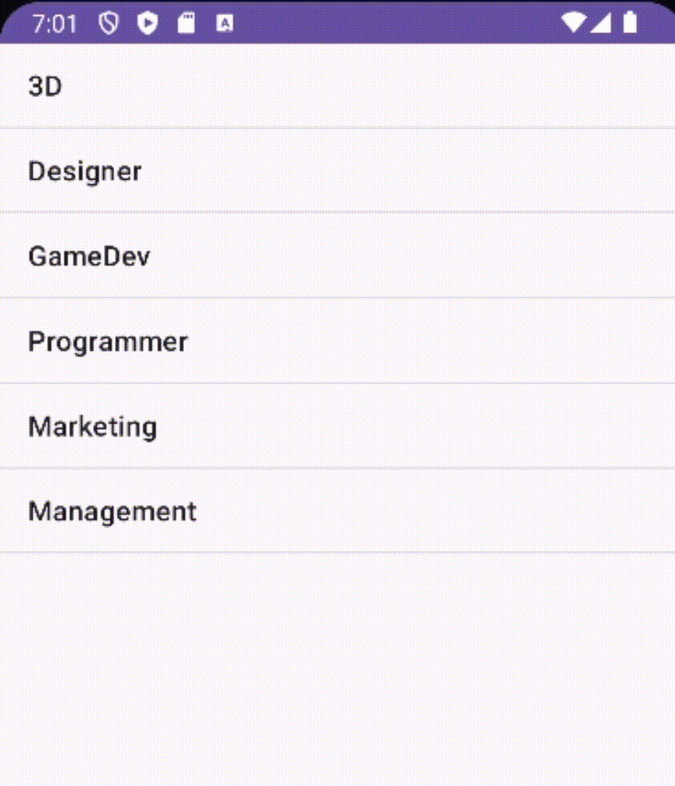

# List
This project is a `list` that can be filled with `anything`

## Compatibility
 
This is already standard, the program is made on `AndroidStudio` and it is not compatible with Apple

|  Android |  Apple |
:-------:|:-------:|
|    ✔️  |    ❌  |

 

<h1 align="center">Important code moments</h1> 

